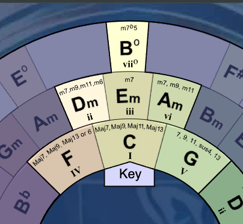

# teach_circle
Interactive circle of fifths (adapted from [Mike Foskett](https://websemantics.uk/tools/circle-of-fifths-chord-wheel/)'s)

---

## Serve it locally

python3 -m http.server 8000

and open http://localhost:8000

---

## Use it online 

https://AdrianArtacho.github.io/teach_circle/
